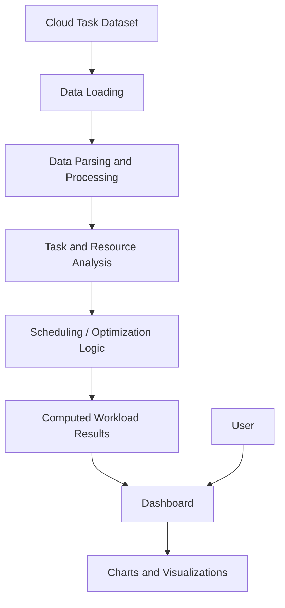

# ⚛️ Quantum Cloud Optimizer

<p align="center">
  <strong>A Quantum-Inspired Cloud Task Scheduling and Resource Optimization Dashboard</strong>
</p>

<p align="center">
  An interactive web application for analyzing cloud workloads, task priorities, deadlines, resource requirements, VM allocation, and execution characteristics through optimization-oriented scheduling and visualization.
</p>

<p align="center">
  <a href="https://github.com/pudarivyshnavi/Quantum-Cloud-Optimizer">Repository</a>
  •
  <a href="https://github.com/pudarivyshnavi">GitHub Profile</a>
</p>

---

## 📑 Table of Contents

- [Overview](#-overview)
- [Problem Statement](#-problem-statement)
- [Motivation](#-motivation)
- [Core Features](#-core-features)
- [Technology Stack](#-technology-stack)
- [System Architecture](#-system-architecture)
- [Architecture Explanation](#-architecture-explanation)
- [Dataset](#-dataset)
- [Dataset Schema](#-dataset-schema)
- [Data Processing](#-data-processing)
- [Simulation and Optimization Logic](#-simulation-and-optimization-logic)
- [Scheduling Factors](#-scheduling-factors)
- [Optimization Concept](#-optimization-concept)
- [System Workflow](#-system-workflow)
- [Application Modules](#-application-modules)
- [Data Visualization](#-data-visualization)
- [Project Structure](#-project-structure)
- [Getting Started](#-getting-started)
- [Prerequisites](#-prerequisites)
- [Installation](#-installation)
- [Running the Development Server](#-running-the-development-server)
- [Production Build](#-production-build)
- [Preview](#-preview)
- [Testing](#-testing)
- [Linting](#-linting)
- [How the Application Works](#-how-the-application-works)
- [Key Capabilities](#-key-capabilities)
- [Project Goals](#-project-goals)
- [Future Enhancements](#-future-enhancements)
- [Important Technical Notes](#-important-technical-notes)
- [Disclaimer](#-disclaimer)
- [Author and Connect](#-author-and-connect)
- [License](#-license)

---

## 🔭 Overview

**Quantum Cloud Optimizer** is a web-based cloud workload analysis and scheduling project designed to explore how optimization concepts can be applied to cloud task management.

The project works with a structured workload dataset containing task characteristics such as task length, priority, deadline, CPU requirements, memory requirements, bandwidth requirements, VM assignment, and execution time.

The application provides a visual environment for understanding workload characteristics and exploring scheduling and optimization concepts through an interactive dashboard.

The project combines:

- Cloud task scheduling concepts
- Resource requirement analysis
- Workload distribution
- Priority and deadline awareness
- VM allocation analysis
- Execution-time analysis
- Data visualization
- Optimization-oriented simulation
- Quantum-inspired optimization concepts

> **Important:** The current project should be understood as a quantum-inspired/optimization-oriented software project and visualization environment. It does not claim to execute workloads on physical quantum hardware unless explicitly implemented in the source code.

---

## 🎯 Problem Statement

Cloud computing environments execute large numbers of tasks across available virtual machines and computing resources.

Efficient task scheduling requires consideration of several workload characteristics, including:

- Task length
- Task priority
- Deadline
- CPU requirement
- Memory requirement
- Bandwidth requirement
- VM assignment
- Execution time

Poor scheduling decisions can result in uneven resource utilization, unnecessary delays, inefficient workload distribution, and increased execution time.

The **Quantum Cloud Optimizer** project explores this scheduling problem through workload analysis, optimization-oriented processing, and visualization.

The goal is to provide a clear environment in which cloud task characteristics can be analyzed and scheduling concepts can be explored systematically.

---

## 💡 Motivation

Cloud workloads are heterogeneous: different tasks can require very different amounts of CPU, memory, bandwidth, execution time, and scheduling priority.

A scheduling strategy therefore needs to consider more than simply processing tasks in the order they arrive.

This project is motivated by the idea of representing cloud scheduling as an optimization problem where multiple task and resource constraints can be considered together.

The project also provides an opportunity to explore how **quantum-inspired optimization concepts** could be applied to complex scheduling problems in future implementations.

---

## ✨ Core Features

The project provides an optimization-focused cloud workload dashboard with capabilities centered around:

- 📊 Cloud workload analysis
- ⚙️ Task scheduling and optimization concepts
- 🎯 Task priority analysis
- ⏱️ Deadline and execution-time analysis
- 💻 CPU resource analysis
- 🧠 Memory requirement analysis
- 🌐 Bandwidth requirement analysis
- 🖥️ Virtual-machine distribution analysis
- 📈 Workload visualization
- 📋 Structured task dataset processing
- 🔬 Optimization-oriented simulation
- ⚛️ Exploration of quantum-inspired cloud optimization concepts
- 🖥️ Interactive web-based dashboard presentation

---

## 🛠️ Technology Stack

| Category | Technology |
|---|---|
| Frontend | React |
| Programming Language | TypeScript |
| Build Tool | Vite |
| Styling | CSS / Tailwind-based styling where implemented |
| Data | Structured TXT/CSV-style workload dataset |
| Visualization | Frontend chart/visualization components used by the application |
| Package Manager | npm |
| Development Server | Vite |

The exact implementation in the repository remains the source of truth for individual components and dependencies.

---

## 🏗️ System Architecture



The application follows a frontend-oriented workflow in which workload information is loaded, processed, analyzed, and presented through the dashboard.

---

## 🧩 Architecture Explanation

### 1. Workload Dataset

The project uses the workload dataset stored in:

```text
data/quantum-tasks.txt
```

The dataset contains structured cloud task information including task length, priority, deadline, CPU requirements, memory requirements, bandwidth, VM assignment, and execution time.

### 2. Data Loading

The application loads the workload information from the project dataset and makes the task records available for processing and analysis.

### 3. Data Processing

The task records are parsed and organized so that their scheduling and resource characteristics can be analyzed.

### 4. Task and Resource Analysis

The application examines workload characteristics such as priority, deadlines, resource requirements, VM allocation, and execution time.

### 5. Scheduling / Optimization Logic

The project represents cloud task scheduling as an optimization-oriented problem where multiple workload characteristics can be considered together.

### 6. Dashboard and Visualization

The processed workload information is presented through the dashboard using charts and visual components that make the task and resource characteristics easier to understand.
📊 Dataset

The project includes a workload dataset located at:

data/quantum-tasks.txt

The dataset uses a structured comma-separated format.

The dataset contains 50 cloud task records, in addition to the header row.

Dataset Header
task_id,length,priority,deadline,cpu_req,memory_req,bandwidth,vm_id,execution_time
Example Records
1,4500,5,15,90,4096,800,1,45
2,100,1,60,5,128,10,3,2
3,3800,5,12,85,3584,750,1,40
4,150,1,55,8,256,15,4,3

The dataset provides a compact representation of heterogeneous cloud workloads and allows the application to analyze differences between tasks and their resource requirements.

🧾 Dataset Schema
Field	Description
task_id	Unique identifier of the cloud task
length	Workload/task length
priority	Priority assigned to the task
deadline	Scheduling deadline associated with the task
cpu_req	CPU requirement of the task
memory_req	Memory requirement of the task
bandwidth	Bandwidth requirement of the task
vm_id	Virtual machine associated with the task
execution_time	Execution time associated with the task
🔄 Data Processing

The workload data provides the foundation for the application's scheduling and visualization process.

The general processing flow consists of:

Loading the task dataset.
Reading the structured task records.
Interpreting task and resource attributes.
Organizing workload information for analysis.
Evaluating scheduling-related characteristics.
Preparing information for dashboard presentation.
Generating visual representations of workload characteristics.

The processing allows the application to compare tasks across different resource and scheduling dimensions.

⚙️ Simulation and Optimization Logic

The project approaches cloud scheduling as an optimization-oriented problem.

Each workload contains multiple characteristics that can influence scheduling decisions.

The optimization perspective considers the relationship between:

Task priority
Task size
Deadline
CPU demand
Memory demand
Bandwidth demand
VM allocation
Execution time

Instead of treating every workload as identical, the project provides a structured representation of heterogeneous tasks so that scheduling and resource allocation can be analyzed from multiple dimensions.

Current Implementation

The current application focuses on workload analysis, scheduling/optimization concepts, and visualization.

Quantum-Inspired Perspective

The project is designed around the idea that complex cloud scheduling problems can potentially benefit from optimization techniques inspired by quantum computing.

However, quantum-inspired concepts should not be interpreted as execution on physical quantum hardware.

Future Quantum Optimization

Advanced algorithms such as:

Quantum Approximate Optimization Algorithm (QAOA)
Quantum annealing
Hybrid quantum-classical optimization

could be explored in future versions.

These are future research directions unless explicitly implemented in the current source code.

📅 Scheduling Factors

Cloud scheduling can involve several competing constraints.

Scheduling Factor	Role
Task Priority	Indicates the relative importance of a task
Task Length	Represents the workload size
Deadline	Represents the required scheduling time constraint
CPU Requirement	Represents required processing capacity
Memory Requirement	Represents required memory capacity
Bandwidth	Represents required communication capacity
VM ID	Identifies the associated virtual machine
Execution Time	Represents task execution characteristics

Considering these factors together provides a more meaningful representation of cloud workload scheduling than considering a single resource dimension.

⚛️ Optimization Concept

The central idea of the project is to treat cloud task scheduling as an optimization problem.

A cloud scheduler may need to balance multiple objectives and constraints simultaneously.

Conceptually, the optimization problem can be represented as:
Cloud Workload
      │
      ├── Priority
      ├── Deadline
      ├── Task Length
      ├── CPU Requirement
      ├── Memory Requirement
      ├── Bandwidth
      ├── VM Assignment
      └── Execution Time
              │
              ▼
       Scheduling Analysis
              │
              ▼
       Optimization Model
              │
              ▼
       Workload Decisions
The project provides a software environment for exploring this optimization perspective.

The term quantum-inspired refers to the project's optimization direction and conceptual foundation; it does not by itself imply execution on a quantum computer.
🔁 System Workflow

Workflow Steps

1. Load Dataset

The application starts with the structured cloud workload dataset.

2. Parse Task Records

Individual task records are interpreted according to their fields.

3. Analyze Workload

Task characteristics such as priority, deadlines, resource requirements, VM allocation, and execution time are analyzed.

4. Scheduling / Optimization

The workload is examined from an optimization-oriented scheduling perspective.

5. Generate Results

Processed information is converted into useful workload and scheduling information.

6. Dashboard Presentation

Results are presented through the web application.

7. Visualization

Charts and visual components provide an easier way to understand the workload.

🖥️ Application Modules

The application is organized around the cloud workload optimization dashboard.

Dashboard

The dashboard provides the main visual interface for understanding the workload and optimization-oriented information.

Workload Analysis

Task information can be examined across multiple dimensions including priority, execution time, VM assignment, and resource requirements.

Resource Analysis

CPU, memory, and bandwidth requirements provide insight into the resource demand associated with the workload.

Scheduling Analysis

Task characteristics provide the foundation for exploring scheduling and optimization decisions.

Visualization

Charts transform structured workload data into visual information that can be interpreted more easily.

📈 Data Visualization

The project uses visualization to make workload characteristics easier to understand.

The dataset can be analyzed through dimensions such as:

Priority Distribution

Shows how workload priority values are distributed across tasks.

VM Distribution

Provides an overview of how tasks are associated with virtual machines.

Execution Time

Shows execution-time characteristics across the workload.

Resource Demand

Provides a visual representation of resource requirements such as CPU, memory, and bandwidth.

Workload Analysis

Combines task characteristics to provide a broader understanding of the workload.

These visualizations help demonstrate how heterogeneous workloads can create different scheduling and resource-allocation requirements.

📁 Project Structure

The project follows a modern React/Vite application structure.
quantum-cloud-optimizer/
│
├── data/
│   └── quantum-tasks.txt
│
├── src/
│   ├── components/
│   ├── pages/
│   ├── ...
│   └── ...
│
├── public/
│
├── package.json
├── package-lock.json
├── vite.config.*
├── tsconfig.*
├── eslint.config.*
└── README.md
The exact source structure may contain additional implementation-specific files and components.

Important Files
| File / Directory         | Purpose                              |
| ------------------------ | ------------------------------------ |
| `data/quantum-tasks.txt` | Cloud workload dataset               |
| `src/`                   | Main application source              |
| `src/components/`        | Reusable UI components               |
| `src/pages/`             | Application pages where implemented  |
| `public/`                | Public/static application assets     |
| `package.json`           | Project dependencies and npm scripts |
| `README.md`              | Project documentation                |
🚀 Getting Started

Follow the steps below to run the Quantum Cloud Optimizer locally.

📋 Prerequisites

Make sure the following are installed:

Node.js
npm
Git

Verify Node.js:
node --version
Verify npm:

npm --version

Verify Git:

git --version
📥 Installation

Clone the repository:

git clone https://github.com/pudarivyshnavi/Quantum-Cloud-Optimizer.git

Move into the project directory:

cd Quantum-Cloud-Optimizer

Install dependencies:

npm install
▶️ Running the Development Server

Start the Vite development server:

npm run dev

The application is configured to run on:

http://localhost:8080/

Open the URL in your browser after the development server starts.

🏭 Production Build

Create a production build using:

npm run build

The generated production files are placed in the project's build output directory according to the Vite configuration.

👀 Preview

To preview the production build locally:

npm run preview
🧪 Testing

The project includes a testing setup through the npm scripts defined in package.json.

Run the test suite with:

npm run test

For continuous/watch-based testing where supported:

npm run test:watch
🔍 Linting

Run the project's linting checks with:

npm run lint

Linting helps identify code-quality and consistency issues within the application source.

🔄 How the Application Works

The overall application process can be summarized as:
                    ┌─────────────────────┐
                    │   Cloud Task Data   │
                    │ quantum-tasks.txt   │
                    └──────────┬──────────┘
                               │
                               ▼
                    ┌─────────────────────┐
                    │    Data Loading     │
                    └──────────┬──────────┘
                               │
                               ▼
                    ┌─────────────────────┐
                    │ Data Processing &   │
                    │ Workload Analysis   │
                    └──────────┬──────────┘
                               │
                               ▼
                    ┌─────────────────────┐
                    │ Scheduling /        │
                    │ Optimization Logic  │
                    └──────────┬──────────┘
                               │
                               ▼
                    ┌─────────────────────┐
                    │ Calculated Results  │
                    └──────────┬──────────┘
                               │
                               ▼
                    ┌─────────────────────┐
                    │ Dashboard & Charts  │
                    └─────────────────────┘
  Step 1 — Workload Input

The application works with structured cloud task records.

Step 2 — Data Processing

Task information is organized according to workload and resource characteristics.

Step 3 — Workload Analysis

Tasks are examined across priority, deadline, resource, VM, and execution dimensions.

Step 4 — Optimization Perspective

The workload is considered as a scheduling and resource-allocation problem.

Step 5 — Visualization

The results are presented using dashboard components and visualizations.

🌟 Key Capabilities

The Quantum Cloud Optimizer demonstrates:

Structured cloud workload representation
Task-level scheduling analysis
Priority-aware workload analysis
Deadline-aware scheduling concepts
CPU requirement analysis
Memory requirement analysis
Bandwidth requirement analysis
VM allocation analysis
Execution-time analysis
Workload visualization
Optimization-oriented cloud scheduling
Quantum-inspired optimization exploration
Modern React/Vite dashboard development
🎓 Project Goals

The major goals of the project are:

Understand cloud task scheduling problems.
Represent heterogeneous cloud workloads using structured data.
Analyze different resource requirements.
Explore scheduling and optimization concepts.
Visualize cloud workload characteristics.
Understand how multiple scheduling constraints interact.
Explore the potential relationship between cloud optimization and quantum-inspired approaches.
Build a modern interactive interface for presenting optimization-related information.
🔮 Future Enhancements

The project can be extended in several directions.

Advanced Quantum Optimization

Future versions could investigate algorithms such as:

QAOA
Quantum annealing
Hybrid quantum-classical optimization
Dynamic Workload Generation

The application could support dynamically generated workloads instead of relying only on static datasets.

Advanced Scheduling Algorithms

Additional scheduling strategies could be implemented and compared.

Cloud Provider Integration

Future versions could connect optimization results with real cloud platforms.

Real-Time Workload Monitoring

Real-time cloud resource and workload monitoring could be integrated.

Larger Datasets

The optimizer could be evaluated using larger and more diverse cloud workload datasets.

Optimization Benchmarking

Multiple scheduling approaches could be compared using standardized workload metrics.

Quantum Hardware Integration

Future research could explore execution of suitable optimization formulations using available quantum computing platforms.

These are future enhancements and should not be interpreted as functionality already implemented in the current version.

📝 Important Technical Notes
The project is implemented as a modern web application.
The workload dataset is stored in data/quantum-tasks.txt.
The dataset contains 50 task records.
The workload contains task, scheduling, resource, VM, and execution characteristics.
The application uses visualization to make workload characteristics easier to understand.
The project explores optimization and scheduling concepts rather than claiming production cloud orchestration.
Quantum-inspired terminology describes the optimization direction of the project.
Physical quantum hardware is not required to run the current web application.
Advanced quantum algorithms are future enhancement opportunities unless implemented separately.
The application is intended primarily as a project for exploring cloud scheduling, optimization, visualization, and quantum-inspired computing concepts.
⚠️ Disclaimer

Quantum Cloud Optimizer is an educational and experimental project developed to explore cloud workload scheduling, resource analysis, visualization, and optimization concepts.

The project should not be interpreted as a production cloud orchestration platform or as evidence of performance on real-world cloud infrastructure unless independently deployed and benchmarked in such an environment.

Similarly, quantum-inspired terminology in the project represents an exploration of optimization concepts and does not imply execution on physical quantum computing hardware.

👩‍💻 Author and Connect
Pudari Vyshnavi

GitHub:

https://github.com/pudarivyshnavi

Project Repository:

https://github.com/pudarivyshnavi/Quantum-Cloud-Optimizer

📄 License

No explicit LICENSE file is currently included in the repository.

The project is therefore presented without an explicitly declared open-source license.

<p align="center"> <strong>⚛️ Quantum Cloud Optimizer</strong> <br> Cloud Workload Analysis • Scheduling • Optimization • Visualization <br><br> Built by <strong>Pudari Vyshnavi</strong> </p> ```
